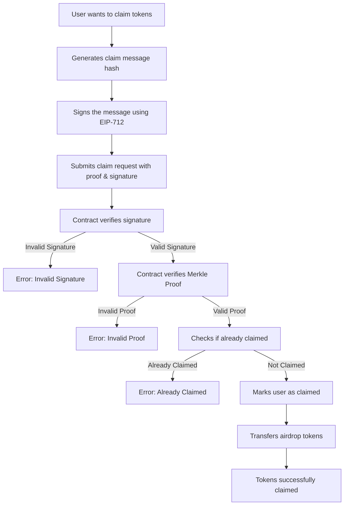

# MerkelAirdrop

## Overview
MerkelAirdrop is a Solidity smart contract deployed on the Sepolia testnet that facilitates secure and verifiable token airdrops using **Merkle proofs** and **EIP-712 signatures**. This contract ensures that only eligible users can claim tokens by verifying their inclusion in a Merkle tree and validating their claims using cryptographic signatures.

The primary purpose of MerkelAirdrop is to provide a **trustless and gas-efficient** method for distributing ERC-20 tokens to multiple recipients while maintaining strong security guarantees. The contract prevents double claims and invalid proofs, ensuring fair token distribution.

## Features
- **Merkle Proof Verification**: Ensures only whitelisted users can claim tokens.
- **EIP-712 Signature Validation**: Users must submit an off-chain signed message for additional security.
- **Prevention of Double Claims**: A mapping tracks claimed addresses to prevent repeated claims.
- **Secure Token Transfers**: Uses OpenZeppelin’s `SafeERC20` library to avoid unsafe token transfers.
- **Gas-Efficient Airdrop**: Instead of looping through multiple addresses on-chain, Merkle proofs allow for individual verification with minimal gas usage.

## Contract Details
- **Network**: Sepolia Testnet
- **Token Standard**: ERC-20
- **Merkle Root**: A cryptographic hash stored at deployment, used to verify eligibility.
- **Libraries Used**:
  - `SafeERC20` for safe token transfers
  - `MerkleProof` for verifying Merkle tree proofs
  - `EIP712` for structured off-chain message signing
  - `ECDSA` for signature recovery and validation

## Deployment Details
- **Merkle Root Initialization**: Set at contract deployment, defining the list of eligible claimants.
- **Airdrop Token**: An ERC-20 token specified at deployment, distributed to verified claimants.
- **Contract Address**: The deployed contract resides on Sepolia; users interact via its public functions.

## Functions and Explanation
### `claim(address account, uint256 amount, bytes32[] calldata merkleProof, bytes memory signature)`
Allows an eligible user to claim tokens by providing a Merkle proof and a valid signature.
- **Checks if the account has already claimed** to prevent double-spending.
- **Validates the EIP-712 signature** to ensure authenticity.
- **Verifies the Merkle proof** to confirm the user is whitelisted.
- **Transfers the specified token amount** to the user upon successful verification.

### `getMessage(address account, uint256 amount) public view returns (bytes32)`
Generates a structured hash of the claim message using EIP-712.
- This hash is used for off-chain signing and later validated on-chain during the claim process.

### `getMerkleRoot() external view returns (bytes32)`
Returns the Merkle root stored in the contract.
- Used for verification purposes and transparency.

### `getAirdropToken() external view returns (IERC20)`
Returns the ERC-20 token being distributed.

### `_isValidSignature(address account, bytes32 digest, bytes memory signature) internal pure returns (bool)`
Validates the signature provided by the claimant.
- Uses `ECDSA` to recover the signer's address from the signature and ensures it matches the expected account.

## Airdrop Claim Flow
The following **Mermaid flowchart** illustrates the claiming process:

## Step-by-Step Guide to Claiming Airdrop
1. **Generate the claim message:** Call `getMessage(account, amount)` to retrieve the hash.
2. **Sign the message off-chain:** Use an Ethereum wallet like MetaMask or a backend service to sign the hash.
3. **Submit the claim:** Call `claim(account, amount, merkleProof, signature)` with the necessary parameters.
4. **Verification process:**
   - The contract checks if the user has already claimed.
   - It verifies the off-chain signature to confirm the claim’s legitimacy.
   - It validates the Merkle proof against the stored Merkle root.
5. **Token transfer:** If all verifications pass, the contract sends tokens to the user’s wallet.

## Security Considerations
### **1. Replay Attack Prevention**
- Each claim is **only allowed once** per user, tracked via the `s_claimed` mapping.

### **2. Signature Validation**
- The contract implements **EIP-712 signatures** to ensure secure and tamper-proof claims.
- Uses `ECDSA.tryRecover()` to verify the authenticity of the signed message.

### **3. Merkle Root Integrity**
- The Merkle root is immutable once set, ensuring eligibility cannot be modified post-deployment.
- The Merkle tree prevents unauthorized claims while keeping the verification process gas-efficient.

### **4. Safe Token Transfers**
- Uses `SafeERC20.safeTransfer()` from OpenZeppelin to mitigate issues like missing return values in ERC-20 transactions.

### **5. Front-Running Protection**
- The requirement of both **Merkle proof and off-chain signature** significantly reduces front-running risks.

## Advantages of Using MerkelAirdrop
1. **Gas Efficiency:** Verifying Merkle proofs is significantly cheaper than looping through arrays of recipients.
2. **Scalability:** Large airdrop distributions are feasible without excessive gas costs.
3. **Security:** Uses cryptographic proofs and signature verification to prevent unauthorized claims.
4. **Flexibility:** Works with any ERC-20 token and supports various distribution models.
5. **Trustless Distribution:** No need for intermediaries or manual verification; everything is done on-chain.

## Potential Enhancements
In future iterations, MerkelAirdrop can incorporate:
- **Batch claims**: Allowing multiple claims in a single transaction for better gas efficiency.
- **Off-chain indexing**: Storing claimed status off-chain to optimize on-chain data usage.
- **Dynamic merkle root updates**: Enabling updates to the eligible claimants list in case of errors or new distributions.

## License
This project is licensed under the **MIT License**, allowing developers to use and modify it freely.

---

By implementing **MerkelAirdrop**, projects can efficiently distribute tokens while maintaining high security standards. Whether used for incentivizing users, rewarding community members, or distributing governance tokens, this contract provides a **gas-efficient, decentralized, and trustless** airdrop mechanism.

